# Phase 7 — Rapport Final de Revue et Préparation au Lancement

**Application** : Sprintflow (sprintys-app)  
**Date** : 2 octobre 2026  
**Auditeur** : Agent 7 — Final Reviewer & Launch Manager  
**Périmètre** : Consolidation des Phases 0 à 6 + vérification technique finale

---

## 1. Résumé Exécutif

L'audit complet de Sprintflow a couvert **7 phases** : inventaire technique (Phase 0), QA & typage (Phase 1), UI/UX (Phase 2), sécurité (Phase 3), RGPD (Phase 4), conformité stores (Phase 5) et performance (Phase 6).

### Bilan global

| Indicateur | Valeur |
|---|---|
| Fichiers source modifiés | **15** |
| Migrations SQL créées | **5** |
| Edge Functions ajoutées/modifiées | **3** (chat modifié, export_data créé, delete_account_and_assets créé) |
| Erreurs TypeScript (`tsc --noEmit`) | **9 erreurs dans 2 fichiers** ❌ |
| Problèmes QA corrigés | 4/7 |
| Vulnérabilités SecOps corrigées | 3/3 |
| Corrections UI/UX appliquées | 4 principales |
| Index de performance ajoutés | 7 |

> [!CAUTION]
> **L'application ne compile pas.** `npx tsc --noEmit` retourne 9 erreurs TypeScript réparties sur 2 fichiers (`settings.tsx` et `group.tsx`). Ces erreurs doivent être résolues avant toute publication.

---

## 2. Résultats de la Vérification TypeScript (`tsc --noEmit`)

**Commande** : `npx tsc --noEmit` dans `sprintys-app/`  
**Résultat** : ❌ **Échec — Code de sortie 1**

### Erreurs détectées

| Fichier | Ligne | Code | Description |
|---|---|---|---|
| `app/(athlete)/settings.tsx` | 74 | TS1005 | `','` expected (x3) — Chaîne mal échappée `'Impossible d\\'exporter les données.'` |
| `app/(athlete)/settings.tsx` | 74 | TS1003 | Identifier expected |
| `app/(athlete)/settings.tsx` | 74 | TS1002 | Unterminated string literal |
| `app/(athlete)/settings.tsx` | 75 | TS1005 | `','` expected |
| `app/(coach)/group.tsx` | 209 | TS1381 | Unexpected token `}` — Erreur de syntaxe JSX (ternaire mal fermé) |
| `app/(coach)/group.tsx` | 291 | TS1381 | Même problème — JSX ternaire cassé |
| `app/(coach)/group.tsx` | 396 | TS1381 | Même problème — JSX ternaire cassé |

### Analyse des causes

1. **`settings.tsx:74`** — La chaîne `Alert.alert('Erreur', 'Impossible d\\'exporter les données.')` utilise un double échappement `\\'` incorrect en JSX/TSX. Il doit être `'Impossible d\'exporter les données.'` ou utiliser un template literal.

2. **`group.tsx:209, 291, 396`** — Trois occurrences identiques d'un pattern JSX conditionnel où un opérateur ternaire est mal structuré. Le `)}` ferme un bloc conditionnel mais le JSX suivant n'est pas encadré par un `<>` ou un conteneur parent. Ces erreurs ont vraisemblablement été introduites lors des modifications de Phase 1 (QA-04, patch avatar) ou Phase 6 (useMemo).

> [!WARNING]
> Ces 9 erreurs sont des **régressions introduites pendant l'audit** (Phases 1/2/6). Elles doivent être corrigées impérativement avant de merger la branche d'audit.

---

## 3. Inventaire des Migrations SQL Créées (Audit)

Toutes les migrations sont dans `sprintys-app/supabase/migrations/` et portent le préfixe `20261002000*`.

| Fichier | Taille | Phase | Description | Statut |
|---|---|---|---|---|
| `20261002000000_meal_logs_coach_access.sql` | 647 o | Phase 3 (SecOps) | Ajoute une politique RLS SELECT sur `meal_logs` pour permettre aux coachs de lire les données nutritionnelles de leurs athlètes approuvés | ✅ Vérifié (logique SQL correcte) |
| `20261002000001_fix_role_spoofing.sql` | 1 085 o | Phase 3 (SecOps) | Corrige le trigger `handle_new_user()` pour valider le rôle (`athlete` ou `coach`) et empêcher le role spoofing | ✅ Vérifié |
| `20261002000002_storage_policies.sql` | 1 732 o | Phase 3 (SecOps) | Crée les politiques RLS sur `storage.objects` pour le bucket `avatars` (SELECT public, INSERT/UPDATE/DELETE restreints au propriétaire) | ✅ Vérifié |
| `20261002000003_health_data_consents.sql` | 2 280 o | Phase 4 (RGPD) | Crée la table `user_consents` + trigger `check_health_data_consent()` qui met à NULL les champs `pains`/`menstruation` si l'utilisateur n'a pas donné son consentement explicite | ✅ Vérifié |
| `20261002000004_performance_indexes.sql` | 992 o | Phase 6 (Perf) | Ajoute 7 index sur les tables fréquemment requêtées (`meal_logs`, `teams`, `subgroups`, `team_members`, `competitions`, `body_metrics`, `profiles`) | ✅ Vérifié |

> [!IMPORTANT]
> **Aucune de ces migrations n'a été exécutée sur un environnement de staging ou de production.** Elles doivent être testées dans cet ordre exact sur un environnement de staging avant tout déploiement.

---

## 4. Cohérence des Edge Functions

### 4.1. `supabase/functions/chat/index.ts` (Modifié)
- **Authentification** : ✅ Vérifie `Authorization` header + `supabase.auth.getUser()`
- **Clé API** : ✅ Récupère `OPENAI_API_KEY` via `Deno.env.get()` — aucun secret codé en dur
- **Modèle restreint** : ✅ Whitelist `['gpt-4o-mini', 'gpt-3.5-turbo']`
- **PII Anonymizer** : ✅ Implémenté (masque emails et mots-clés santé avant envoi à OpenAI)
- **CORS** : ⚠️ `Access-Control-Allow-Origin: '*'` — acceptable pour une Edge Function Supabase (le token Auth est le vrai mécanisme de sécurité)

### 4.2. `supabase/functions/export_data/index.ts` (Nouveau)
- **Authentification** : ✅ Double vérification (service role pour identification, anon key + auth header pour les requêtes RLS)
- **Périmètre des données** : ✅ Exporte `profiles`, `body_metrics`, `workouts`, `athlete_efforts`, `meal_logs`, `check_ins`
- **Header Content-Disposition** : ✅ Force le téléchargement en JSON
- **Observation** : ⚠️ Le client initial est créé avec `SUPABASE_SERVICE_ROLE_KEY` (ligne 25) mais le commentaire indique que c'est pour la vérification du token. Les requêtes réelles utilisent bien le `userClient` avec l'anon key. **Risque faible** — le service role client ne fait qu'une extraction de token, pas de requête de données.

### 4.3. `supabase/functions/delete_account_and_assets/index.ts` (Nouveau)
- **Authentification** : ✅ Vérifie l'identité via anon key avant d'utiliser le service role
- **Suppression Storage** : ✅ Extrait le chemin avatar depuis `profile.avatar_url` et supprime via `supabase.storage.from('avatars').remove()`
- **Suppression Compte** : ✅ Utilise `adminSupabase.auth.admin.deleteUser()` — cascade automatique via les foreign keys
- **Observation** : ⚠️ Si `avatar_url` ne contient pas `/avatars/` (format non standard), le fichier ne sera pas supprimé. Edge case à surveiller.

---

## 5. Inventaire Complet des Fichiers Modifiés

### 5.1. Fichiers source modifiés (non commités — `git diff`)

| Fichier | Phase(s) | Nature de la modification |
|---|---|---|
| `app.json` | Phase 5 | Permissions natives (caméra, micro, localisation, photos) |
| `app/(athlete)/body.tsx` | Phases 1, 2 | Refactoring Input partagé + corrections de typage |
| `app/(athlete)/nutrition.tsx` | Phase 2 | Prop `readonly` pour isoler la vue coach |
| `app/(athlete)/settings.tsx` | Phase 4 | Ajout bouton export données (**⚠️ contient erreur TS**) |
| `app/(coach)/athlete/[id].tsx` | Phase 1 | Correction `avatar_url` inexistant (QA-04) |
| `app/(coach)/group.tsx` | Phases 1, 6 | Corrections types + useMemo (**⚠️ contient erreurs TS**) |
| `app/chat/[type]/[id].tsx` | Phase 5 | Fonctionnalité Signaler/Bloquer (UGC compliance) |
| `src/components/WorkoutProposalCard.tsx` | Phase 1 | Correction prop `id` + `subgroup_id` (QA-02, QA-03) |
| `src/features/auth/components/steps/StepAccount.tsx` | Phase 4 | Ajout champ date de naissance (protection mineurs) |
| `src/features/calendar/components/StrengthWorkoutBuilder.tsx` | Phase 1 | Corrections de typage liées |
| `src/features/coach/components/TeamHealthModal.tsx` | Phase 2 | Remplacement texte brut par `EmptyState` |
| `src/features/nutrition/components/MealSection.tsx` | Phase 2 | Ajout prop `readonly` pour masquer le bouton « Ajouter » |
| `src/shared/components/EditProfileModal.tsx` | Phase 2 | Refactoring vers composant `Input` partagé |
| `src/store/nutrition/nutritionStore.ts` | Phase 1 | Correction signature `fetchHistory()` (QA-01) |
| `supabase/functions/chat/index.ts` | Phases 3, 4 | PII Anonymizer + restriction de modèle |

### 5.2. Fichiers créés (non trackés — `git status ??`)

| Fichier | Phase | Description |
|---|---|---|
| `supabase/functions/export_data/index.ts` | Phase 4 | Edge Function d'export RGPD (portabilité) |
| `supabase/functions/delete_account_and_assets/index.ts` | Phase 4 | Edge Function de suppression de compte + avatars |
| `supabase/migrations/20261002000000_meal_logs_coach_access.sql` | Phase 3 | RLS coach → meal_logs |
| `supabase/migrations/20261002000001_fix_role_spoofing.sql` | Phase 3 | Anti-role spoofing |
| `supabase/migrations/20261002000002_storage_policies.sql` | Phase 3 | RLS Storage avatars |
| `supabase/migrations/20261002000003_health_data_consents.sql` | Phase 4 | Table consentements santé |
| `supabase/migrations/20261002000004_performance_indexes.sql` | Phase 6 | Index de performance |

### 5.3. Scripts de patch temporaires (à nettoyer avant merge)

```
fix_avatar.js, fix_settings.js, fix_stepaccount.js, 
patch.js, patch2.js, patch3.js, patch_coach.js, 
patch_run_1.js → patch_run_7.js, patch_sprinty.js, patch_theme.js
```

> [!NOTE]
> Ces **15 scripts de patch** sont des artefacts d'exécution de l'audit automatisé. Ils doivent être supprimés ou ajoutés au `.gitignore` avant le merge.

---

## 6. Checklist de Lancement

### ✅ Éléments Résolus (avec preuve technique)

| # | Élément | Preuve |
|---|---|---|
| 1 | Correction du typage `nutritionStore.fetchHistory()` (QA-01) | `git diff` — paramètre `athleteId` ajouté |
| 2 | Correction `subgroups` → `subgroup_id` dans `WorkoutProposalCard` (QA-03) | `git diff` — propriété renommée |
| 3 | Correction `avatar_url` dans `athlete/[id].tsx` (QA-04) | `git diff` — suppression de la référence inexistante |
| 4 | Refactoring UI : `EditProfileModal`, `body.tsx` → composant `Input` partagé | `git diff` — remplacement `TextInput` → `Input` |
| 5 | Isolation coach dans `MealSection` (prop `readonly`) | `git diff` — bouton masqué si `readonly` |
| 6 | `EmptyState` dans `TeamHealthModal` | `git diff` — composant ajouté |
| 7 | RLS `meal_logs` pour accès coach | Migration `20261002000000` vérifiée |
| 8 | Anti-role spoofing dans `handle_new_user()` | Migration `20261002000001` vérifiée |
| 9 | Politiques Storage RLS pour avatars | Migration `20261002000002` vérifiée |
| 10 | Table `user_consents` + trigger santé | Migration `20261002000003` vérifiée |
| 11 | 7 index de performance sur tables clés | Migration `20261002000004` vérifiée |
| 12 | PII Anonymizer dans l'Edge Function chat | Code vérifié — masque emails et mots-clés santé |
| 13 | Edge Function `export_data` (portabilité RGPD) | Code vérifié — exporte profil, métriques, efforts, repas, check-ins |
| 14 | Edge Function `delete_account_and_assets` (droit à l'effacement) | Code vérifié — supprime avatars + compte en cascade |
| 15 | Permissions natives dans `app.json` (caméra, micro, localisation, photos) | `git diff app.json` |
| 16 | Fonctionnalité Signaler/Bloquer dans le chat (UGC — Guideline 1.2) | `git diff app/chat/[type]/[id].tsx` |
| 17 | Restriction des modèles OpenAI (whitelist) | Vérifié dans `chat/index.ts` lignes 40-41 |

### ❌ Éléments Bloquants Avant Publication

| # | Élément | Criticité | Action requise |
|---|---|---|---|
| 1 | **9 erreurs TypeScript** dans `settings.tsx` (6) et `group.tsx` (3) | **CRITIQUE** | Corriger l'échappement de chaîne dans `settings.tsx:74` et les ternaires JSX dans `group.tsx:209,291,396` |
| 2 | **Migrations non testées en staging** | **CRITIQUE** | Exécuter les 5 migrations `20261002*` sur un environnement de staging Supabase et valider les résultats |
| 3 | **Scripts de patch à nettoyer** | ÉLEVÉ | Supprimer les 15 fichiers `patch*.js`/`fix_*.js` avant le merge |
| 4 | **Edge Functions non déployées** | ÉLEVÉ | Déployer `export_data` et `delete_account_and_assets` via `supabase functions deploy` |
| 5 | **Absence de tests automatisés** | ÉLEVÉ | Aucun test Jest/Vitest n'existe. Les régressions ne peuvent être détectées que manuellement |

### ⚠️ Éléments en Attente d'une Décision Humaine

| # | Élément | Domaine | Question |
|---|---|---|---|
| 1 | **Qualification des données de santé** | Juridique (RGPD Art. 9) | Les champs `pains` et `menstruation` dans `check_ins` sont-ils juridiquement des « données de santé » ? |
| 2 | **Âge minimum d'utilisation** | Juridique/Métier | L'application accepte-t-elle les mineurs ? Si oui, à partir de quel âge (13-16 ans selon le pays UE) ? Un flux de consentement parental est-il nécessaire ? |
| 3 | **Durée de conservation des comptes inactifs** | Juridique | Après combien de temps d'inactivité les comptes doivent-ils être supprimés (1 an ? 3 ans ? 5 ans ?) ? |
| 4 | **Rédaction Politique de Confidentialité et CGU** | Juridique | Textes légaux à rédiger et intégrer dans l'application |
| 5 | **DPA (Data Processing Agreement)** | Juridique | Accords de traitement des données à conclure avec Supabase et OpenAI (incluant les CCT pour les transferts vers les États-Unis) |
| 6 | **Maintien d'OpenAI pour le chat** | Métier/Technique | Confirmation que les données utilisateurs transitant par OpenAI sont acceptables, ou envisager un modèle auto-hébergé |
| 7 | **Territoires de lancement** | Métier | Quels pays/régions ? Impacte le RGPD, CCPA, et la localisation du cluster Supabase |
| 8 | **Modèle économique** | Métier | Gratuit/payant ? Si payant, quel processeur de paiement (Stripe, RevenueCat) ? À ajouter en tant que sous-traitant RGPD |
| 9 | **AIPD (Analyse d'Impact)** | Juridique | Déterminer si une AIPD est requise (données sensibles + grande échelle + profils vulnérables) |
| 10 | **Formulation du consentement santé** | Juridique | Texte exact de l'opt-in à afficher aux utilisateurs pour les données physiologiques |

### 📋 Recommandations Post-Lancement

| # | Recommandation | Priorité |
|---|---|---|
| 1 | Mettre en place une suite de tests automatisés (Jest + React Native Testing Library) | Haute |
| 2 | Migrer la configuration ESLint de `.eslintrc.js` vers le format `eslint.config.js` (ESLint 9 Flat Config) | Moyenne |
| 3 | Résoudre les 523 avertissements ESLint (dont les `any` implicites) | Moyenne |
| 4 | Implémenter des skeleton loaders pour les écrans principaux (Dashboard Coach, SessionCarousel) | Moyenne |
| 5 | Améliorer la validation inline des formulaires (utiliser la prop `error` du composant `Input`) | Faible |
| 6 | Implémenter un `pg_cron` ou webhook pour la purge automatique des comptes inactifs | Moyenne |
| 7 | Remplacer les `.map()` dans `ScrollView` par des `FlatList` pour les grandes listes | Moyenne |
| 8 | Envisager un mode sombre (actuellement forcé à `isDark: false`) | Faible |
| 9 | Ajouter App Tracking Transparency (ATT) si des SDK de tracking sont ajoutés | Conditionnelle |
| 10 | Remplir le formulaire de sécurité des données sur Google Play Console | Obligatoire avant publication |

---

## 7. Risques Résiduels

| Risque | Probabilité | Impact | Mitigation |
|---|---|---|---|
| **Régressions TypeScript non corrigées** bloquent le build | Certaine | Critique | Corriger les 9 erreurs identifiées |
| **Migrations SQL non validées en staging** provoquent des erreurs en production | Moyenne | Critique | Tester sur staging avant déploiement |
| **PII Anonymizer incomplet** — les mots-clés santé couverts sont limités (10 termes français) | Moyenne | Moyen | Enrichir la liste de mots-clés, ajouter les traductions pour les marchés non-francophones |
| **Absence de tests automatisés** — les régressions futures ne seront pas détectées | Élevée | Élevé | Priorité post-lancement : mettre en place Jest |
| **Export `export_data`** utilise `SUPABASE_SERVICE_ROLE_KEY` dans le premier client (avant de passer au user client) | Faible | Faible | Le service role client n'effectue que l'extraction de token. Risque théorique si le code évolue sans précaution |
| **Avatars orphelins post-suppression** si le format `avatar_url` ne contient pas `/avatars/` | Faible | Faible | Normaliser le format d'URL des avatars à l'upload |
| **CORS `Access-Control-Allow-Origin: *`** sur les Edge Functions | Faible | Faible | Acceptable pour des fonctions protégées par Auth token. Restreindre si les fonctions deviennent publiques |

---

## 8. Synthèse par Phase

```mermaid
flowchart LR
    P0["Phase 0\nInventaire"]
    P1["Phase 1\nQA/TS"]
    P2["Phase 2\nUI/UX"]
    P3["Phase 3\nSecOps"]
    P4["Phase 4\nRGPD"]
    P5["Phase 5\nStores"]
    P6["Phase 6\nPerformance"]
    P7["Phase 7\nRevue Finale"]

    P0 -->|"Stack identifiée\nExpo + Supabase"| P1
    P1 -->|"4/7 corrigés\n3 ouverts"| P2
    P2 -->|"4 améliorations\nInput partagé"| P3
    P3 -->|"3 vulnérabilités\n3 corrigées"| P4
    P4 -->|"4 remédiations\n10 décisions humaines"| P5
    P5 -->|"Permissions OK\nUGC ajouté"| P6
    P6 -->|"7 index\nuseMemo"| P7
    P7 -->|"9 erreurs TS ❌\n5 migrations ✅"| P7
```



---

## 9. Verdict Final

### 🔴 L'application N'EST PAS prête pour la publication en l'état.

**Avant de publier, il est impératif de :**

1. ❌ **Corriger les 9 erreurs TypeScript** (estimé : 15-30 min de travail)
2. ❌ **Tester les 5 migrations SQL** sur un environnement de staging
3. ❌ **Déployer les Edge Functions** `export_data` et `delete_account_and_assets`
4. ❌ **Nettoyer les scripts de patch** temporaires
5. ⚠️ **Obtenir les décisions juridiques** (RGPD, CGU, DPA) — *bloquant pour un lancement en UE*
6. ⚠️ **Rédiger la Politique de Confidentialité** — *bloquant pour les stores*

**Une fois ces 4 premiers points techniques résolus**, l'application sera techniquement prête pour un déploiement en staging et des tests QA manuels. Les points 5 et 6 sont des prérequis légaux et commerciaux pour la publication sur les stores.

---

*Rapport généré automatiquement — Phase 7, 2 octobre 2026*
